```mermaid
---
title: ERSAP C++ – Service Architecture
---
flowchart TB

%% ── Styles ───────────────────────────────────────────────────────────────
classDef userClass  fill:#161b22,stroke:#30363d,color:#e6edf3,stroke-width:1.5px
classDef orchClass  fill:#0a1a0c,stroke:#238636,color:#3fb950,stroke-width:1.5px
classDef feClass    fill:#1a1205,stroke:#9e7429,color:#e3b341,stroke-width:1.5px
classDef cppClass   fill:#130d24,stroke:#8957e5,color:#bc8cff,stroke-width:1.5px
classDef stdClass   fill:#0d1822,stroke:#1f6feb,color:#58a6ff,stroke-width:1.5px
classDef xportClass fill:#0c1419,stroke:#21262d,color:#8b949e
classDef warnClass  fill:#1a0800,stroke:#c0392b,color:#f0883e,stroke-width:1.5px

%% ══════════════════════════════════════════════════════════════════════════
%%  USER ALGORITHM  –  the only code a domain scientist writes
%% ══════════════════════════════════════════════════════════════════════════
subgraph USER["User C++ Algorithm  ·  developer implements the Engine contract"]
    direction LR

    ENG["abstract class Engine  (C++14)<br/>───────────────────────────────────────<br/>pure virtual:<br/>  EngineData configure(EngineData&amp;)<br/>  EngineData execute(EngineData&amp;)<br/>  EngineData execute_group(vector&lt;EngineData&gt;&amp;)<br/>  vector&lt;EngineDataType&gt; input_data_types()  const<br/>  vector&lt;EngineDataType&gt; output_data_types() const<br/>  string name()  /  author()  /  description()  /  version()<br/>───────────────────────────────────────<br/>non-pure (provide default no-op):<br/>  set&lt;string&gt; states()  { return {}; }<br/>  void reset()          { }<br/>  virtual ~Engine()   = default"]

    IMPL["UserEngine  :  public Engine<br/>───────────────────────────────────────<br/>user-supplied domain logic:<br/>  event reconstruction, calibration,<br/>  format conversion, filtering, …<br/>───────────────────────────────────────<br/>compiled to shared library:<br/>  Linux  →  libUserEngine.so<br/>  macOS  →  libUserEngine.dylib<br/>───────────────────────────────────────<br/>must export C factory symbol:<br/>  extern &quot;C&quot;<br/>  unique_ptr&lt;ersap::Engine&gt; create_engine()"]

    ENG -. "user subclasses" .-> IMPL
end

%% ══════════════════════════════════════════════════════════════════════════
%%  ORCHESTRATOR  –  Java process, manages C++ workers remotely
%% ══════════════════════════════════════════════════════════════════════════
subgraph ORCH["ORCHESTRATOR  ·  Java process  ·  manages C++ DPEs remotely"]
    direction LR

    YAML["services.yaml<br/>─────────────────<br/>services:<br/>  - name: CalibSvc<br/>    lang: cpp<br/>  - name: RecoSvc<br/>    lang: cpp<br/>  - name: FilterSvc<br/>    lang: cpp<br/>io-services:<br/>  reader: EvioReader<br/>  writer: HipoWriter<br/>config: {threads: 8}"]

    OCHSTACK["GenericOrchestrator<br/>  → AbstractOrchestrator<br/>  → CoreOrchestrator<br/>  → BaseOrchestrator (xMsg API)<br/>─────────────────<br/>WorkerNode per C++ DPE:<br/>  deployContainer (retry × 10)<br/>  deployService · configure<br/>  execute · exit · query<br/>  event counter · EOF detection"]

    YAML --> OCHSTACK
end

%% ══════════════════════════════════════════════════════════════════════════
%%  FRONT-END DPE  –  Java process; C++ DPEs always connect here
%% ══════════════════════════════════════════════════════════════════════════
subgraph FE["FRONT-END DPE  ·  Java process  ·  C++ DPEs always connect here"]
    direction LR

    PROXY["xMsg Proxy<br/>─────────────<br/>ZMQ PUB/SUB broker<br/>port 7771<br/>routes all messages<br/>by canonical topic"]

    REG["xMsg Registrar<br/>─────────────<br/>global component DB<br/>port 7775  (= DPE+4)<br/>C++ DPEs · Containers<br/>· Services register here<br/>at startup"]

    FEREP["DPE ReportService<br/>─────────────<br/>receives heartbeats<br/>dpeAlive (JSON)<br/>dpeReport (JSON)<br/>from all C++ workers"]
end

%% ══════════════════════════════════════════════════════════════════════════
%%  C++ WORKER DPE
%% ══════════════════════════════════════════════════════════════════════════
subgraph CDPE["C++ WORKER DPE  ·  host:7781_cpp  ·  always a worker  (never FrontEnd)"]
    direction TB

    SL["ServiceLoader<br/>─────────────────────────────────────────<br/>dlopen(libUserEngine.so | .dylib, RTLD_NOW)<br/>  searches LD_LIBRARY_PATH / DYLD_LIBRARY_PATH<br/>dlsym(handle, 'create_engine')<br/>  calls factory → unique_ptr&lt;Engine&gt;<br/>one ServiceLoader instance per deployed service<br/>handle kept alive for duration of service lifetime"]

    subgraph CONT["Container  ·  host:7781_cpp:containerName"]
        direction TB

        subgraph SVC["Service  ·  host:7781_cpp:containerName:engineName"]
            direction TB

            CB["Callback (ZMQ subscriber)<br/>subscribes to canonical service topic<br/>dispatches on message action field:<br/>  no action  →  setup()<br/>  CONFIGURE  →  configure()<br/>  other      →  execute()"]

            SE["ServiceEngine<br/>─────────────────────────────<br/>owns  unique_ptr&lt;Engine&gt;<br/>no shared instance between threads<br/>mutex serialises setup vs execute<br/>─────────────────────────────<br/>execute() flow:<br/>  1. deserialize EngineData from Protobuf<br/>  2. call engine-&gt;execute(input)<br/>  3. record ServiceReport metrics<br/>  4. determine output links<br/>  5. serialize result → ZMQ publish"]

            TP["tp::ThreadPool<br/>─────────────────────────────<br/>mpmc_bounded_queue (capacity 1024)<br/>N worker threads (configurable)<br/>posts configure / execute lambdas<br/>non-blocking enqueue; blocks if full"]

            SC["SimpleCompiler<br/>─────────────────────────────<br/>parses composition string by '+' delimiter<br/>A + B + C + D<br/>locates own service name in the chain<br/>outputs[0]  =  immediate next service only<br/>─────────────────────────────<br/>⚠ limitations vs Java CCC:<br/>  · linear pipelines only<br/>  · no fan-out  (A + B, C)<br/>  · no conditionals  (if / elseif / else)<br/>  · no stateful routing"]

            ROUTE["Output Routing<br/>─────────────────────────────<br/>for each link in outputs:<br/>  Protobuf-serialize EngineData<br/>  connect to next service proxy<br/>  ZMQ publish on canonical topic<br/>─────────────────────────────<br/>⚠ always serialized — even same host<br/>NO SharedMemory optimisation"]

            REP["ServiceReport<br/>─────────────────────────────<br/>per-request metrics collected by ServiceEngine:<br/>  request count · execute time (µs)<br/>  bytes received · bytes sent<br/>published periodically to FrontEnd"]

            CB --> SE
            SE --> TP
            TP --> SC
            SC --> ROUTE
            SE --> REP
        end
    end

    DREP["DPE ReportService<br/>─────────────────────────────────────────<br/>std::thread heartbeat loop<br/>std::condition_variable wait (interruptible)<br/>on each tick:<br/>  serialize DPE state → JSON<br/>  publish dpeAlive  topic → FrontEnd proxy<br/>  publish dpeReport topic → FrontEnd proxy<br/>stopped cleanly by stop() → cv.notify_all()"]

    SL --> CONT
    CONT --> DREP
end

%% ══════════════════════════════════════════════════════════════════════════
%%  ersap::stdlib  –  abstract bases for standard service patterns
%% ══════════════════════════════════════════════════════════════════════════
subgraph STDLIB["ersap::stdlib  ·  abstract base classes for standard service patterns"]
    direction LR

    ERS["EventReaderService<br/>────────────────────<br/>open_file(json params)<br/>close_file()<br/>read_event(int index)<br/>  → unique_ptr&lt;void&gt;<br/>read_event_count()<br/>  → int<br/>read_byte_order()<br/>  → ByteOrder<br/>get_data_type()<br/>  → EngineDataType<br/>────────────────────<br/>user returns raw bytes;<br/>framework wraps in EngineData"]

    EWS["EventWriterService<br/>────────────────────<br/>open_file(string path,<br/>          json params)<br/>close_file()<br/>write_event(void* event,<br/>            int size,<br/>            int order)<br/>────────────────────<br/>symmetric to reader;<br/>receives EngineData,<br/>extracts bytes, writes<br/>to domain file format"]

    SS["StreamingService<br/>────────────────────<br/>connect(int stream_port,<br/>        json config)<br/>disconnect()<br/>process_frame(int frame)<br/>  → EngineData<br/>────────────────────<br/>for live data sources:<br/>TriDAS online trigger<br/>VTP (VME Trigger Proc)<br/>frame-by-frame pull<br/>instead of file I/O"]
end

%% ══════════════════════════════════════════════════════════════════════════
%%  TRANSPORT LAYER
%% ══════════════════════════════════════════════════════════════════════════
subgraph TRANSPORT["TRANSPORT  ·  xMsg / ZeroMQ PUB/SUB  +  Protocol Buffers"]
    direction LR

    ZMQ["ZeroMQ PUB/SUB<br/>topic = canonical service name<br/>all inter-service messages<br/>all inter-DPE heartbeats<br/>TCP between hosts"]

    PROTO["Protocol Buffers<br/>EngineData on the wire<br/>mime-type tag preserved<br/>C++ ↔ C++ ↔ Java ↔ Python<br/>in same composition chain"]

    PORTS["C++ port: 7781<br/>Registrar: 7785  (= 7781+4)<br/>FrontEnd proxy: 7771<br/>FrontEnd registrar: 7775"]

    NAMES["Canonical naming<br/>host%port_lang:container:engine<br/>──────────────────────────<br/>10.0.0.2%7781_cpp:det:Calib<br/>10.0.0.3%7781_cpp:det:Reco"]
end

%% ══════════════════════════════════════════════════════════════════════════
%%  CONNECTIONS
%% ══════════════════════════════════════════════════════════════════════════

%% User code → framework loading
IMPL -->|"dlopen + dlsym<br/>create_engine() factory"| SL

%% Orchestrator → FrontEnd
OCHSTACK -->|"xMsg API: deploy · configure<br/>execute · exit · query"| PROXY

%% C++ DPE registers with FE at startup
SL -.->|"register DPE · Container<br/>· Services on startup"| REG

%% FE → C++ DPE lifecycle
PROXY -->|"START_CONTAINER<br/>START_SERVICE<br/>STOP_SERVICE"| CONT

%% C++ DPE → FE heartbeat
DREP -->|"dpeAlive · dpeReport JSON<br/>periodic heartbeat"| FEREP

%% stdlib used by Service implementations
ERS -. "user Service subclasses" .-> SVC
EWS -. "user Service subclasses" .-> SVC
SS  -. "user Service subclasses" .-> SVC

%% Transport anchors
PROXY --- ZMQ
ROUTE --- PROTO
ROUTE --- ZMQ

%% ══════════════════════════════════════════════════════════════════════════
%%  APPLY STYLES
%% ══════════════════════════════════════════════════════════════════════════
class ENG,IMPL userClass
class YAML,OCHSTACK orchClass
class PROXY,REG,FEREP feClass
class SL,CB,SE,TP,SC,ROUTE,REP,DREP cppClass
class ERS,EWS,SS stdClass
class ZMQ,PROTO,PORTS,NAMES xportClass
```

# ERSAP C++ Architecture

**Environment for Realtime Streaming Acquisition and Processing**
C++ binding — data processing services deployed as shared libraries, orchestrated by the ERSAP framework.

---



---

## C++ Engine Contract

A C++ ERSAP service is a shared library that:

1. **Subclasses** `ersap::Engine`
2. **Exports** the C factory function `create_engine()`
3. **Is compiled** to `libName.so` (Linux) or `libName.dylib` (macOS)

```cpp
// MyEngine.hpp
#include <ersap/engine.hpp>

class MyEngine : public ersap::Engine {
public:
    ersap::EngineData configure(ersap::EngineData& input) override;
    ersap::EngineData execute(ersap::EngineData& input) override;
    ersap::EngineData execute_group(const std::vector<ersap::EngineData>&) override;

    std::vector<ersap::EngineDataType> input_data_types()  const override;
    std::vector<ersap::EngineDataType> output_data_types() const override;

    std::string name()        const override { return "MyEngine"; }
    std::string author()      const override { return "Author"; }
    std::string description() const override { return "Does X"; }
    std::string version()     const override { return "1.0"; }
};

// MyEngine.cpp  –  required factory export
extern "C" std::unique_ptr<ersap::Engine> create_engine() {
    return std::make_unique<MyEngine>();
}
```

## SimpleCompiler Limitation

C++ compositions are **linear only**. The `SimpleCompiler` tokenises the composition string by `+` and routes output to the immediate next service name. No conditionals and no fan-out are supported.

```
# works in C++
CalibSvc + RecoSvc + FilterSvc + WriterSvc ;

# NOT supported in C++ (Java only)
if(CalibSvc == "good") { RecoSvc }
else { BypassSvc };
```

## ersap::stdlib Service Bases

| Base class | Use case | Key abstract methods |
|---|---|---|
| `EventReaderService` | File-based event source | `open_file` · `close_file` · `read_event` · `read_event_count` · `read_byte_order` |
| `EventWriterService` | File-based event sink | `open_file` · `close_file` · `write_event` |
| `StreamingService` | Live TriDAS / VTP stream | `connect` · `disconnect` · `process_frame` |

## Port Convention (C++ DPE)

```
C++ DPE port   : 7781
C++ Registrar  : 7785  (= 7781 + 4)
FrontEnd proxy : 7771  (always Java — C++ connects here)
FrontEnd reg   : 7775
```
