```mermaid
---
title: ERSAP – Polyglot Streaming Data Processing Framework
---
flowchart TB

%% ── Node styles ──────────────────────────────────────────────────────────
classDef orchClass  fill:#0a1a0c,stroke:#238636,color:#3fb950,stroke-width:1.5px
classDef feClass    fill:#1a1205,stroke:#9e7429,color:#e3b341,stroke-width:1.5px
classDef javaClass  fill:#0a1628,stroke:#1f6feb,color:#58a6ff,stroke-width:1.5px
classDef cppClass   fill:#130d24,stroke:#8957e5,color:#bc8cff,stroke-width:1.5px
classDef userClass  fill:#161b22,stroke:#30363d,color:#e6edf3
classDef warnClass  fill:#1a0800,stroke:#c0392b,color:#f0883e,stroke-width:1.5px
classDef xportClass fill:#0c1419,stroke:#21262d,color:#8b949e

%% ══════════════════════════════════════════════════════════════════════════
%%  USER ALGORITHM LAYER
%% ══════════════════════════════════════════════════════════════════════════
subgraph USER["User Algorithm  ·  developer implements the framework contract"]
    direction LR

    subgraph UJAVA["Java  (packaged as JAR)"]
        JI["«interface» Engine<br/>─────────────────────────<br/>configure(EngineData) : EngineData<br/>execute(EngineData) : EngineData<br/>executeGroup(Set&lt;EngineData&gt;) : EngineData<br/>getInputDataTypes() / getOutputDataTypes()<br/>getStates() / reset() / destroy()"]
        JU["UserEngine.class<br/>implements Engine<br/>─────────────────────────<br/>any domain algorithm:<br/>event reconstruction, calibration,<br/>format conversion, filtering …"]
        JI -. "user implements" .-> JU
    end

    subgraph UCPP["C++  (shared library)"]
        CI["abstract class Engine  (C++14)<br/>─────────────────────────<br/>virtual configure(EngineData&amp;) = 0<br/>virtual execute(EngineData&amp;) = 0<br/>virtual execute_group(vector&lt;EngineData&gt;&amp;) = 0<br/>virtual input_data_types() = 0<br/>virtual output_data_types() = 0<br/>virtual reset() {}  ·  virtual ~Engine() = default<br/>virtual name() / author() / description() / version()"]
        CU["libUserEngine.so  (Linux)<br/>libUserEngine.dylib  (macOS)<br/>─────────────────────────<br/>must export symbol:<br/>  unique_ptr&lt;Engine&gt; create_engine()"]
        CI -. "user subclasses" .-> CU
    end
end

%% ══════════════════════════════════════════════════════════════════════════
%%  ORCHESTRATOR  –  drives the entire pipeline cloud from one Java process
%% ══════════════════════════════════════════════════════════════════════════
subgraph ORCH["ORCHESTRATOR  ·  Java process  ·  drives the entire pipeline"]
    direction TB

    YAML["services.yaml<br/>─────────────────────────<br/>io-services:<br/>  reader: ReaderService<br/>  writer: WriterService<br/>services:<br/>  - SvcA  (lang: java)<br/>  - SvcB  (lang: cpp)<br/>mime-types:  [hipo, evio]<br/>config:  {threads: 4, …}"]

    subgraph ORCHSTACK["Orchestrator Class Hierarchy"]
        direction TB
        GOC["GenericOrchestrator<br/>CLI entry point  ·  parses args<br/>file-queue loop  ·  ReconstructionStats<br/>throughput / latency reporting"]
        AOC["AbstractOrchestrator<br/>BlockingQueue&lt;WorkerFile&gt;<br/>WorkerNode pool  (one per DPE)<br/>processing Semaphore  ·  EOF detection"]
        COC["CoreOrchestrator<br/>deployContainer (retry × 10 with backoff)<br/>deployService  ·  configure  ·  execute<br/>listen  ·  query  ·  exit"]
        BOC["BaseOrchestrator<br/>thin wrapper over xMsg API<br/>deploy / configure / execute /<br/>listen / query / exit primitives"]
        WN["WorkerNode  (one per DPE instance)<br/>reader + processing services + writer<br/>ErsapLang per service  (java | cpp | python)<br/>event counter  ·  EOF tracking"]
        GOC --> AOC --> COC --> BOC
        GOC -. "manages" .-> WN
    end

    CCC["Composition DSL  (embedded in message metadata)<br/>─────────────────────────────────────────────────<br/>Linear:      A + B + C ;<br/>Fan-out:     A + B, C ;   (B and C receive same output)<br/>Conditional  (Java only):<br/>  if(A == state){ B }  elseif(A == other){ C }  else{ D };"]

    YAML --> ORCHSTACK
    CCC -. "routing instructions\nper message" .-> WN
end

%% ══════════════════════════════════════════════════════════════════════════
%%  FRONT-END DPE  –  Java only, hosts the global component registrar
%% ══════════════════════════════════════════════════════════════════════════
subgraph FE["FRONT-END DPE  ·  host:7771_java  ·  Java only"]
    direction LR

    PROXY["xMsg Proxy<br/>─────────────<br/>ZMQ PUB/SUB broker<br/>port 7771<br/>topic-based routing<br/>fan-out to all subscribers<br/>local + remote peers"]

    REG["xMsg Registrar<br/>─────────────<br/>global component database<br/>port  =  DPE port + 4  (7775)<br/>stores: DPEs · Containers · Services<br/>indexed by canonical name<br/>Java · C++ · Python all register here"]

    GWC["GatewayCallback<br/>─────────────<br/>handles remote commands:<br/>START_REMOTE_DPE<br/>STOP_REMOTE_DPE<br/>START_REMOTE_SERVICE<br/>STOP_REMOTE_SERVICE<br/>⚠ all handler methods<br/>are empty TODO stubs"]

    DRS["DPE ReportService<br/>─────────────<br/>aggregates worker heartbeats<br/>publishes dpeAlive  (JSON)<br/>publishes dpeReport (JSON)<br/>configurable period<br/>broadcasts to all subscribers"]

    MON["Monitor FrontEnd<br/>─────────────<br/>optional sidecar<br/>$ERSAP_MONITOR_FE env var<br/>topic: ring:state:session:engine<br/>realtime state-tagged monitoring"]

    SHMEM["Java SharedMemory<br/>─────────────<br/>zero-copy intra-JVM transfer<br/>ConcurrentHashMap&lt;receiver,<br/>  Map&lt;sender:commId, EngineData&gt;&gt;<br/>receiver must be pre-registered<br/>C++ has NO equivalent"]
end

%% ══════════════════════════════════════════════════════════════════════════
%%  JAVA WORKER DPE
%% ══════════════════════════════════════════════════════════════════════════
subgraph JDPE["JAVA WORKER DPE  ·  port 7771_java"]
    direction TB

    JEL["EngineLoader<br/>ClassLoader.loadClass(engineClass)<br/>engine class resolved from classpath / JAR<br/>validates: input types · output types<br/>description · version · author"]

    subgraph JCONT["Container  ·  host:7771_java:containerName"]
        direction TB

        subgraph JSVC["Service  ·  host:7771_java:containerName:engineName"]
            direction TB
            JPOOL["ServiceEngine pool  [0 … N]<br/>ALL N slots share ONE Engine instance<br/>⚠ Engine.execute() must be thread-safe<br/>ExecutorService (fixed-N thread pool)<br/>Semaphore gates concurrent access"]
            JCOMP["CompositionCompiler  (one per ServiceEngine)<br/>full CCC: linear · fan-out · if/elseif/else<br/>compiles routing string per request<br/>caches compiled Instruction sets"]
            JPATH["Output routing<br/>SharedMemory check: receiver registered in JVM?<br/>  YES → zero-copy put + tiny ZMQ notify (ersap/shmkey)<br/>  NO  → Protobuf serialize → ZMQ publish to next service"]
            JPOOL --> JCOMP --> JPATH
        end
    end

    JREP["DPE ReportService<br/>heartbeat thread: publishes dpeAlive + dpeReport JSON to FE<br/>default period 10 000 ms  ·  stopped on DPE exit<br/>Severity-13 kill-switch: System.exit(13) on fatal engine error"]

    JEL --> JCONT
    JCONT --> JREP
end

%% ══════════════════════════════════════════════════════════════════════════
%%  C++ WORKER DPE  –  always a worker; never a FrontEnd
%% ══════════════════════════════════════════════════════════════════════════
subgraph CDPE["C++ WORKER DPE  ·  port 7781_cpp  ·  always connects to Java FrontEnd"]
    direction TB

    CSL["ServiceLoader<br/>dlopen(libEngine.so | .dylib, RTLD_NOW)<br/>dlsym(handle, 'create_engine')<br/>returns unique_ptr&lt;Engine&gt;<br/>one loader instance per service"]

    subgraph CCONT["Container  ·  host:7781_cpp:containerName"]
        direction TB

        subgraph CSVC["Service  ·  host:7781_cpp:containerName:engineName"]
            direction TB
            CSE["ServiceEngine  (single instance)<br/>owns unique_ptr&lt;Engine&gt;<br/>no shared instance — no thread-safety concern<br/>mutex serialises setup vs execute<br/>tp::ThreadPool (mpmc_bounded_queue, cap 1024)"]
            CCOMP["SimpleCompiler<br/>tokenises composition by '+' separator<br/>linear A + B + C ; only<br/>no conditionals · no fan-out<br/>outputs only the immediate next service"]
            CZPATH["Output routing<br/>NO SharedMemory path<br/>always: Protobuf serialize → ZMQ publish<br/>even when sender and receiver are on same host"]
            CSE --> CCOMP --> CZPATH
        end
    end

    CREP["DPE ReportService  +  ersap::stdlib<br/>std::thread heartbeat → dpeAlive + dpeReport JSON → Java FE<br/>condition_variable wait · interrupted by stop() signal<br/>─────────────────────────────────────────────────────<br/>ersap::stdlib abstract bases:<br/>EventReaderService  (open/close/read_event/read_event_count)<br/>EventWriterService  (symmetric writer abstraction)<br/>StreamingService    (TriDAS / VTP live: connect / process_frame)"]

    CSL --> CCONT
    CCONT --> CREP
end

%% ══════════════════════════════════════════════════════════════════════════
%%  TRANSPORT LAYER
%% ══════════════════════════════════════════════════════════════════════════
subgraph TRANSPORT["TRANSPORT LAYER  ·  xMsg / ZeroMQ PUB/SUB  +  Protocol Buffers"]
    direction LR

    ZMQ["ZeroMQ PUB/SUB<br/>topic-based message routing<br/>all nodes · all languages<br/>TCP transport between hosts"]

    PROTO["Protocol Buffers<br/>EngineData serialized on the wire<br/>cross-language: Java ↔ C++ ↔ Python<br/>used for all inter-DPE data transfer"]

    PORTCONV["Port Convention<br/>Java DPE    7771<br/>C++ DPE     7781<br/>Python DPE  7791<br/>Registrar   DPE port + 4"]

    NAMECONV["Canonical Naming<br/>host%port_lang:container:engine<br/>─────────────────────────<br/>10.0.0.1%7771_java:myContainer:SvcA<br/>10.0.0.2%7781_cpp:myContainer:SvcB"]
end

%% ══════════════════════════════════════════════════════════════════════════
%%  CROSS-SYSTEM CONNECTIONS
%% ══════════════════════════════════════════════════════════════════════════

%% User algorithm → DPE loading mechanism
JU -->|"ClassLoader.loadClass()<br/>JAR on classpath"| JEL
CU -->|"dlopen / dlsym<br/>shared library"| CSL

%% Orchestrator → FrontEnd control plane
BOC -->|"xMsg API<br/>deploy · configure · execute · exit · query"| PROXY

%% Worker DPEs register with FE Registrar at startup
JEL -.->|"register: DPE · Container · Services"| REG
CSL -.->|"register: DPE · Container · Services"| REG

%% FE → Workers: lifecycle commands (via GatewayCallback)
GWC -->|"START / STOP<br/>Container · Service"| JCONT
GWC -->|"START / STOP<br/>Container · Service"| CCONT

%% Workers → FE: periodic heartbeat reports
JREP -->|"dpeAlive · dpeReport JSON"| DRS
CREP -->|"dpeAlive · dpeReport JSON"| DRS

%% Cross-language pipeline data (Java ↔ C++ in same composition)
JPATH <-->|"cross-language pipeline data<br/>Protobuf serialized · ZMQ PUB/SUB"| CZPATH

%% SharedMemory feeds the Java output routing decision
SHMEM -.->|"zero-copy same-JVM path"| JPATH

%% Transport layer anchors
PROXY --- ZMQ
JPATH --- PROTO
CZPATH --- PROTO

%% ══════════════════════════════════════════════════════════════════════════
%%  APPLY STYLES
%% ══════════════════════════════════════════════════════════════════════════
class YAML,GOC,AOC,COC,BOC,WN,CCC orchClass
class PROXY,REG,DRS,MON,SHMEM feClass
class GWC warnClass
class JEL,JPOOL,JCOMP,JPATH,JREP javaClass
class CSL,CSE,CCOMP,CZPATH,CREP cppClass
class JI,JU,CI,CU userClass
class ZMQ,PROTO,PORTCONV,NAMECONV xportClass
```

# ERSAP Architecture

**Environment for Realtime Streaming Acquisition and Processing**
Polyglot micro-services framework · Java · C++ · Python · ZeroMQ + Protocol Buffers

---



---

## Key Design Decisions

| Concern | Java | C++ |
|---|---|---|
| Engine contract | `interface Engine` | `abstract class Engine` |
| Dynamic loading | `ClassLoader.loadClass()` · JAR | `dlopen` / `dlsym` · `.so` / `.dylib` |
| Concurrency | N `ServiceEngine`s share **one** `Engine` instance | One `ServiceEngine` owns `unique_ptr<Engine>` |
| Composition routing | Full CCC: `if` / `elseif` / `else` + fan-out | `SimpleCompiler`: linear `A+B+C` only |
| Intra-host transfer | **SharedMemory** zero-copy (same JVM only) | Always ZMQ-serialized |
| FrontEnd role | Any Java DPE can be FrontEnd (hosts Registrar) | Never FrontEnd — always a worker |
| Standard library | `GenericOrchestrator` orchestration classes | `ersap::stdlib`: Reader / Writer / Streaming |
| Severity-13 | `System.exit(13)` on fatal engine status | Not present |
| FE gateway | `GatewayCallback` handles remote DPE commands | n/a (C++ DPEs are workers only) |

## Naming Convention

```
host%port_lang : containerName : engineName

10.0.0.1%7771_java : myContainer : RecoEngine
10.0.0.2%7781_cpp  : myContainer : CalibEngine
```

## Port Assignments (ErsapConstants)

```
Java DPE    → 7771   Registrar → 7775  (= 7771 + 4)
C++ DPE     → 7781   Registrar → 7785
Python DPE  → 7791   Registrar → 7795
```
